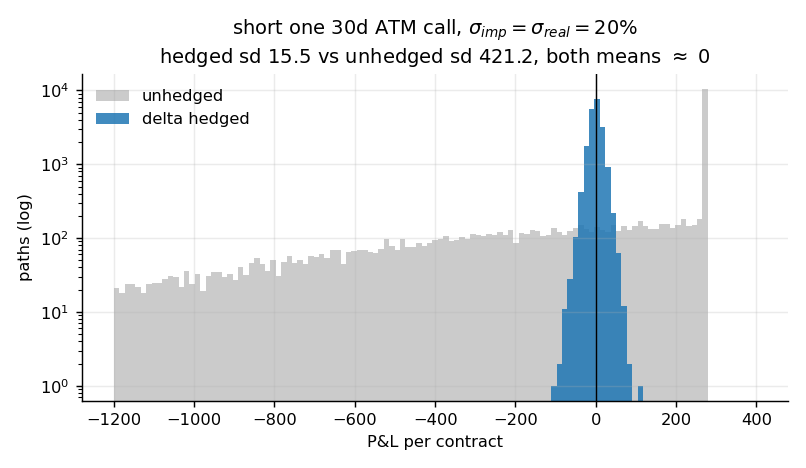
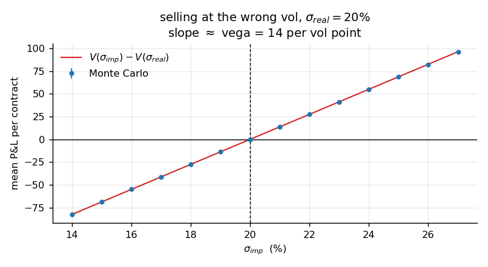
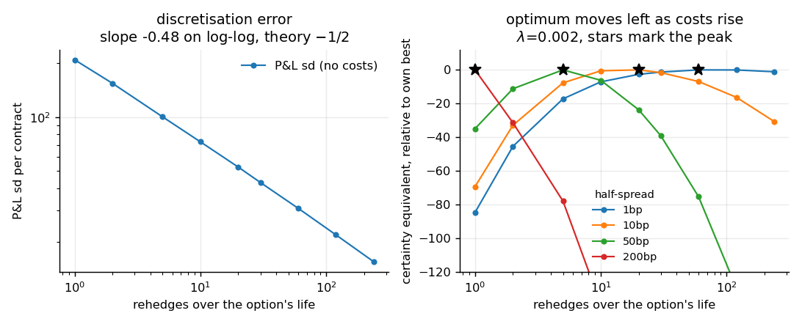
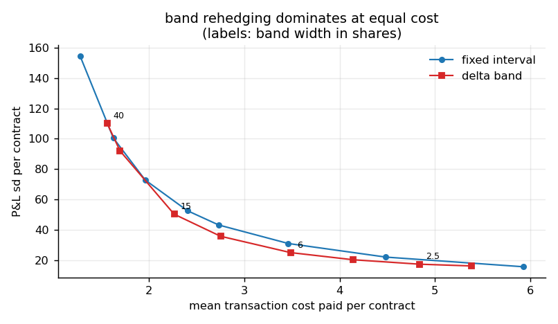
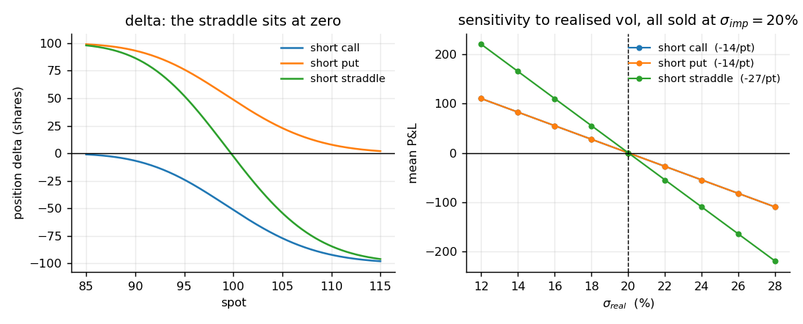

# delta-hedging-pnl

Monte Carlo experiments on the P&L of a delta-hedged short option, testing

    P&L = ½ ∫ Γ S² (σ_imp² − σ_real²) dt

Terminal spot doesn't appear in the identity. Once delta is hedged, what's
left is the gap between the vol you sold at and the vol that realised.

## Running

    pip install -r requirements.txt
    python experiments.py

Writes five figures to `figures/`.

## Files

    bs.py           Black-Scholes prices and greeks
    hedging.py      GBM paths, discrete hedging with costs, band rehedging
    experiments.py  the experiments below

## Experiments

Short one 30-day ATM call throughout, S = K = 100, 20k paths.

**1 — the identity.** σ_imp = σ_real = 20%, no costs, 240 rehedges. Mean P&L
−0.00 (se 0.11) against a premium of 275. Sd falls 421 → 15.5.

**2 — selling at the wrong vol.** Sweeping σ_imp against σ_real = 20% gives a
line of slope 13.7 per vol point against a vega of 13.8. Means sit on
V(σ_imp) − V(σ_real) to within 0.32.

**3 — how often to rehedge.** Discretisation error falls as n^−0.48 (theory
−1/2), cost grows linearly. The optimum is interior only once costs matter:
around 60 rehedges at a 1bp half-spread, 1 at 200bp.

**4 — bands against fixed intervals.** A delta band dominates fixed-interval
rehedging over most of the cost/risk frontier — 25 sd vs 31 at equal spend.

**5 — calls, puts, straddles.** Γ_call = Γ_put follows from put-call parity, so
a short straddle carries ~zero delta and exactly twice the gamma of either
leg. Sensitivity to realised vol is −27 per vol point against −14 for one
leg. Delta cancels between the two; the risk that costs money doesn't.

## Assumptions

r = 0, no dividends, GBM, hedged at implied vol on a fixed grid, proportional
half-spread on the stock leg only. Nothing is calibrated to market data —
paths are simulated precisely so σ_real can be set independently of σ_imp.

## License

MIT
